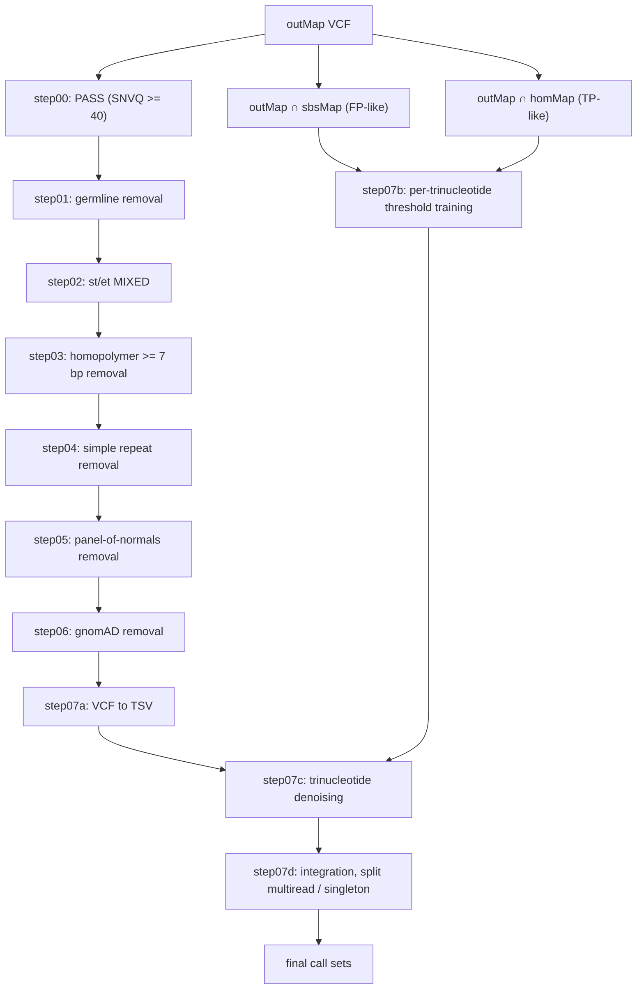

# ppmSeq variant calling

Developed by KAIST (Dr. Do Hyeon Cha, Dr. Saehoon Jung, Jinhee Ryu, Yunhye Noh, Dr. Young Seok Ju, and Dr. Changuk Chung) and Inocras Inc. (Dr. Sangmoon Lee) with advices from UCSD School of Medicine (Jiaming Weng, Robyn Howarth, and Dr. Joseph G. Gleeson)

Thanks to NYGC (Dr. Alexandre Pellan Cheng, and Dr. Dan-Avi Landau) for idea-pitching

Two-stage workflow that generates ppmSeq SNV call sets analyzed in our paper:

1. **SRSNV** (`srsnv/`): runs the Ultima Single Read SNV pipeline on ppmSeq CRAM
   files to produce per-read SNV FeatureMaps with quality scores.
2. **Post-hoc filtering** : a Snakemake pipeline that filters the
   FeatureMaps into three final call sets per sample: **multiread**,
   **putative multiread** and **high-confidence (HC) singleton**.

The pipeline was developed for and tested with **Ultima SRSNV v1.22.1**.

```
ppmseq/
├── README.md
├── srsnv/                     # stage 1: SRSNV run scripts
│   ├── featuremap.sh
│   ├── Snakefile
│   ├── snake_conf.example.yaml
│   ├── run_srsnv_legacy.sb
│   └── input_paths.example.tsv
├── Snakefile                  # stage 2: post-hoc filtering
├── config.example.yaml
└── scripts/                
```

## Stage 1: outMap generation (SRSNV)

`srsnv/` contains the scripts used to run the Ultima SRSNV pipeline on the
ppmSeq CRAM files. It produces the three inputs of stage 2:

| Product | Ultima SRSNV step |
|---|---|
| FeatureMap | GATK `FlowFeatureMapper` (`srsnv/featuremap.sh`), then `annotate_featuremap` |
| `sbsMap` | Loci supported by a single read (single-substitution FeatureMap, `vcflite`) |
| `homMap` | Homozygous-SNV FeatureMap (`create_hom_snv_featuremap`) |
| `outMap` | FeatureMap scored by the trained classifier (`srsnv_training`, `srsnv_inference`) |

- Stage 1 is run once per sample in its own working directory, using
`srsnv/Snakefile`, a config file `snake_conf.yaml` (tool, container and
reference paths; see `snake_conf.example.yaml`) and a sample sheet
`input_paths.tsv`. Jobs are submitted to SLURM with `run_srsnv_legacy.sb`.

- `input_paths.tsv` is tab-separated with the columns
`id`, `sex`, `cram`, `sample`, `sorter_stats_json`, `matched_normal`
(`matched_normal` is not used and can be `NA`). The `sample` name is used for
all output files.

- The inputs of stage 2 are written to `2.0-vcflite_SBSMap/` (sbsMap),
`3.0-create_homeSnvFeatureMap/` (homMap) and `6.0-outmap/` (outMap).

Step descriptions follow the Ultima documentation
(`Ultimagen/healthomics-workflows`, v1.22.1).


## Stage 2: post-hoc filtering

### Workflow



| Snakemake rule | Script | Description |
|---|---|---|
| `overlap_sbs` | `overlap_sbs.sh` | Intersect outMap with sbsMap (FP-like training data) |
| `overlap_hom` | `overlap_hom.sh` | Intersect outMap with homMap (TP-like training data) |
| `step00_pass` | `pass_calls.sh` | Keep `FILTER == PASS` (SNVQ >= 40) |
| `step01_germline` | `vcf_to_vcf_overlap_filter.py` | Remove germline variants |
| `step02_st_et` | `st_et_mixed.sh` | Keep reads with `st == MIXED` and `et == MIXED` |
| `step03_hmer` | `vcf_to_bed_overlap_filter.sh` | Remove homopolymer (>= 7 bp) regions |
| `step04_str` | `vcf_to_bed_overlap_filter.sh` | Remove simple tandem repeat regions |
| `step05_pon` | `vcf_to_vcf_overlap_filter.py` | Remove panel-of-normals variants |
| `step06_gnomad` | `vcf_to_vcf_overlap_filter.py` | Remove gnomAD variants (AF > 1e-3) |
| `step07a_conversion` | `conversion.py` | Convert the filtered VCF to a TSV table |
| `step07b_training` | `hom_and_single.py` | Learn per-trinucleotide `ML_QUAL` thresholds |
| `step07c_denoising` | `trinuc_denoising.py` | Apply the thresholds (plus a global floor) |
| `step07d_integration` | `trinucDenoised_integration_refining.py` | TSV to VCF, collapse duplicates, annotate, split |
| `final` | `make_final_vcfs.sh` | Write the final call sets |

## Requirements

- Snakemake <version>
- bcftools <version>, htslib (bgzip, tabix) <version>, bedtools <version>
- Python <version> with pandas <version>, numpy <version>, scikit-learn <version>

## Input

Place the stage 1 outputs in `input/` (the location is set in `config.yaml`).
Samples are discovered automatically from `*.outMap.vcf.gz`.

| File | Description |
|---|---|
| `{sample}.outMap.vcf.gz` | Per-read SNV FeatureMap from the Ultima SRSNV pipeline. `QUAL` is the recalibrated SNVQ; `INFO/ML_QUAL` is the raw classifier score |
| `{sample}.sbsMap.vcf.gz` | Loci supported by a single read (FP-like training data) |
| `{sample}.homMap.vcf.gz` | Loci supported by most reads, likely homozygous germline (TP-like training data) |

All VCFs must be bgzipped and tabix-indexed. Each sample also needs a germline
VCF, given in `config.yaml` (`germline_vcf`). See `config.example.yaml`.

## Resources

The following files are expected in `resources/`.

| File | Source / how it was generated |
|----|---|
| `af-only-gnomad.hg38.snps.AF_over_1e-3.vcf.gz` | GATK Mutect2 `af-only-gnomad` resource (hg38), restricted to SNPs with AF > 0.001 |
| `PON_q40_12files.dedup.vcf` | Panel of normals merged from 12 ppmSeq call sets (10 cfDNA samples and 2 additional ppmSeq somatic call sets) provided by Ultima Genomics |
| `hmers_7_and_higher.chr1-22XY.bed` | Homopolymers of length ≥ 7 bp in hg38 distributed by Ultima Genomics |
| `simple_repeats_hg38.bed` | UCSC Genome Browser Simple Repeats track (hg38) |

## Usage

- Sample names and their germline VCFs are specified in `config.yaml`
(see `config.example.yaml`)

+ The pipeline was run on a SLURM cluster inside a tmux session

```bash
tmux new -s ppmseq
snakemake --slurm -j 10 --cores 20 --keep-going \
    --default-resources slurm_partition="___" \
    --rerun-incomplete --configfile config.yaml
```

+ Memory (`mem_mb`) and runtime (minutes) of every rule are declared in the Snakefile.

## Output

Per sample, in `output/{sample}/`:

| File | Definition |
|---|---|
| `final_multiread_{sample}.vcf.gz` | Variants seen in >= 2 records after denoising, with no other allele at the position in the raw outMap |
| `final_putative_multiread_{sample}.vcf.gz` | Variants seen once after denoising but >= 2 times in the raw outMap, with no other allele at the position |
| `final_singleton_HC_{sample}.vcf.gz` | Variants seen exactly once at every level (all four `DUP_COUNT_*` values equal 1) |

The call sets carry the following `INFO` annotations, computed from the raw outMap:

| Field | Meaning |
|---|---|
| `DUP_COUNT_FILTERED` | Number of denoised records for the same `CHROM:POS:REF:ALT` before collapsing |
| `DUP_COUNT_RAW_MULTI_ALLELE` | Raw outMap records at the same `CHROM:POS` (any REF/ALT) |
| `DUP_COUNT_RAW` | Raw outMap records with the same `CHROM:POS:REF:ALT` |
| `DUP_COUNT_SNVQ40` | Of those, records with `FILTER == PASS` (SNVQ >= 40) |

* `interm/`: the two training intersections (outMap ∩ sbsMap, outMap ∩ homMap)
* `output/{sample}/`: the final call sets, the outputs of every step (`step00_*` to `step07_*`), `training_dataset.tsv`, `trinuc_thresholds_{sample}.tsv` and `pipeline.log`

## Method notes

- **Two quality scores.** `QUAL` (SNVQ) is the recalibrated score used for the
  `PASS` filter (SNVQ >= 40). `INFO/ML_QUAL` is the raw, pre-recalibration
  classifier score used for the trinucleotide thresholds.
- **Trinucleotide thresholds.** For each trinucleotide context, the `ML_QUAL`
  cutoff separating FP-like from TP-like variants is chosen by Youden's J.
  Contexts are taken in the orientation in which the read was sequenced
  (192 motifs, not collapsed to 96). Variants must pass both their context's
  threshold and a global `ML_QUAL` floor of 12. Contexts without a learned
  threshold use the floor.
- **Three-tier call sets.** Rather than discarding single-read evidence, variants are tiered as multiread, putative multiread (one record after denoising, two or more in the raw outMap, but not used in this paper.) or HC singleton, where tracing back to the raw outMap confirms exactly one PASS record with no competing allele, so that singletons reliable enough to be verified by orthogonal sequencing are kept and as many accurate variants as possible are recovered.

## Citation

1. Cheng, A. P. et al. Paired plus-minus sequencing is an ultra-high throughput and accurate method for dual strand sequencing of DNA molecules. Preprint at https://doi.org/10.1101/2025.08.11.669689 (2025).
2. Cheng, A. P. et al. Error-corrected flow-based sequencing at whole-genome scale and its application to circulating cell-free DNA profiling. Nat. Methods 22, 973–981 (2025).
